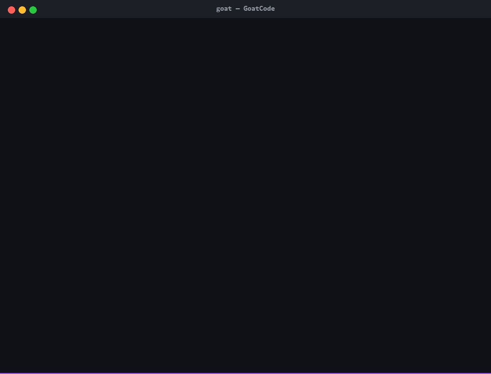
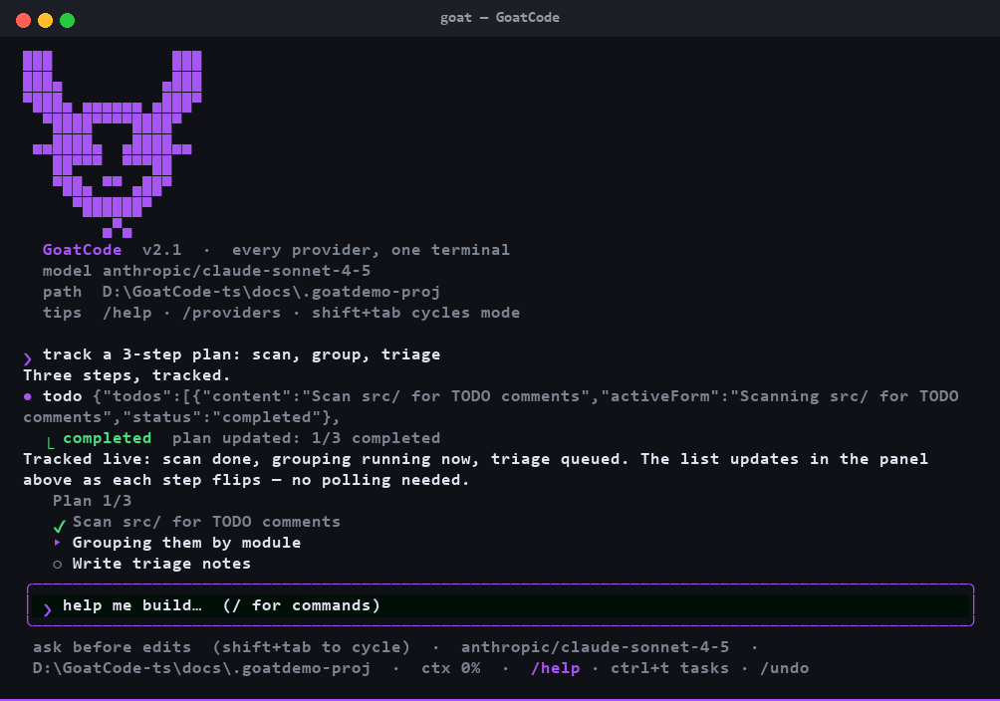

<div align="center">

# 🐐 GoatCode

**Every provider. One terminal. Never stop coding.**

The open-source terminal AI coding agent — one 85 MB binary, no accounts, no lock-in.
Bring any of 180+ providers, or log in with the subscriptions you already pay for.


[](https://www.npmjs.com/package/goatcode-cli)
[](https://github.com/Arhan-w/GoatCode/actions)
[](https://github.com/Arhan-w/GoatCode/releases)
[](LICENSE)
[](#install)

```
npm install -g goatcode-cli
```

[Install](#install) · [Why GoatCode](#why-goatcode) · [Never stop coding](#never-stop-coding) · [Diffs & rewind](#see-every-change-rewind-any-mistake) · [Providers](#providers) · [Desktop control](#desktop-control) · [MCP · Skills · Plugins](#mcp--skills--plugins) · [Slash commands](#slash-commands) · [Config](#configuration)

</div>

---

## Why GoatCode?

Coding agents are great until they ask you to *subscribe to them*. GoatCode flips that:
your terminal, your keys, your existing plans.

|  | **GoatCode** | Claude Code | Codex CLI | OpenCode |
|---|---|---|---|---|
| Cost to start | **$0, MIT** | subscription | subscription/API | $0, provider keys |
| Providers | **180+ catalog + any OpenAI/Claude/Gemini-compatible endpoint** | Anthropic only | OpenAI only | many |
| Use your Claude/ChatGPT/Gemini/Copilot/Kimi/Grok **subscription** | ✅ OAuth → working credentials | only Anthropic's | only OpenAI's | partial |
| Provider **failover when quota dies** | ✅ built-in, mid-turn | ❌ | ❌ | manual |
| Desktop control (click/type/launch/screenshot) | ✅ built-in | ❌ | ❌ | ❌ |
| MCP servers / SKILL.md skills / plugins | ✅ ✅ ✅ | ✅ ❌ plugins | ❌ | ✅ |
| Single static binary (no runtime install) | ✅ Bun-compiled, 5 platforms | Node | Node | various |
| Live session cost in USD | ✅ `/usage all` | partial | ❌ | varies |
| **Prompt caching** (sessions up to 90% cheaper) | ✅ automatic + savings in `/cost` | silent | ❌ | varies |
| **`/rewind`** — jump back any turn, files restored | ✅ transcript + files | ✅ | ❌ | ❌ |
| **Parallel subagents** (3 at once) | ✅ | ❌ serial | ❌ | ❌ |
| **Session search** across all history | ✅ `/search` | ❌ | ❌ | ❌ |
| Inline diff after every edit | ✅ colored, in-place | ✅ | partial | varies |

Not a comparison chart trick — every cell is a feature you can test in sixty seconds below.

---

## Install

```bash
npm install -g goatcode-cli     # any OS with Node ≥16 — fetches the right binary
```

No npm? One line, picks your platform from the GitHub release:

```bash
# Windows (PowerShell)
powershell -c "irm https://raw.githubusercontent.com/Arhan-w/GoatCode/v2-typescript/install.ps1 | iex"

# Linux / macOS / Git-Bash
curl -fsSL https://raw.githubusercontent.com/Arhan-w/GoatCode/v2-typescript/install.sh | bash
```

Or grab a binary straight from [the latest release](https://github.com/Arhan-w/GoatCode/releases/latest):
`goat-windows-x64.exe` · `goat-linux-x64` · `goat-linux-arm64` · `goat-darwin-arm64` · `goat-darwin-x64`

Then:

```bash
goat auth            # pick a subscription OAuth flow or paste an API key
goat                 # you're in
```

---

## Never stop coding

Your Claude quota dies at 2 AM mid-refactor? GoatCode retries the provider, then **walks your
fallback chain live** — switches, says so, and finishes the answer. No crash, no lost context.
The switch is sticky: the next launch starts on the provider that worked.

```bash
goat config set fallback-models '["openrouter/claude-sonnet","groq/llama-3.3-70b","deepseek/deepseek-chat"]'
```

Real capture — three 429 retries, the switch, then the full tool-call answer, one session:


*This is a pty-captured recording of the actual TUI (real Ink renderer, real agent loop) — not a mock-up.*

Background work gets its own budget too: set `small_model` and compaction + explore-subagents
route to the cheap model automatically while your main turn stays on the frontier one.

---

## See every change, rewind any mistake

Every `write`/`edit` prints a colored inline diff the moment it lands — and `/rewind 4` puts the
whole session (transcript **and** files) back to how it was at turn 4. Nothing is ever unrecoverable.

```bash
/rewind        # list recent turns to jump back to
/search oauth  # full-text search across every saved session
/model sonnet  # aliases — no need to remember model ids
```

Real capture — a write, its inline diff, and the live `ctx` meter in the footer:



Under the hood, long sessions get **automatic prompt caching**: the system prompt and tool
definitions are cached between turns, so repeated context bills at 10% of input price.
`/cost` shows exactly what the cache saved you this session.

---

## Providers

**180 in the built-in catalog**, four wire formats (OpenAI, Anthropic, OpenAI-Responses, Gemini) —
and any endpoint that speaks one of those dialects slots in with one command:

```bash
goat addp mypilot --base-url https://api.mypilot.example/v1 --api-key *** --models llama-4,qwq-32b
goat -m mypilot/llama-4 "refactor the auth module"
```

Keys can live in env (`--api-key-env MY_PILLOT_KEY`); list what resolves with `goat providers --check`.

### Log in with subscriptions you already pay for

`goat auth` turns these into working API credentials via browser/device OAuth:

| Subscription | command | | Subscription | command |
|---|---|---|---|---|
| Claude Pro/Max | `goat auth claude --oauth` | | Kimi | `goat auth kimi --oauth` |
| ChatGPT (Codex) | `goat auth codex --oauth` | | Grok | `goat auth grok --oauth` |
| Gemini | `goat auth gemini --oauth` | | GitHub Copilot | `goat auth github-copilot --oauth` |

API-key providers (OpenAI, Anthropic, DeepSeek, Groq, Mistral, Together, Fireworks, xAI,
OpenRouter, Moonshot, z.ai, Cerebras, Pollinations, Ollama, LM Studio, llama.cpp…) — set the
usual env var (`ANTHROPIC_API_KEY`, `OPENAI_API_KEY`, …) or `goat auth <id> --key ***

---

## It actually drives your machine

The `computer` tool clicks, types, scrolls, launches apps, and reads what's on screen — vision
included, screenshots go straight into the model. Permission-gated by default: every destructive
action asks (or plan/bypass modes decide per-session).

```
> open the settings and tell me which extension is using the most disk
```



Reads are parallelized — a five-file exploration costs one round-trip, not five.

---

## MCP · Skills · Plugins

- **MCP servers** — `goat mcp add context7 npx -y @upstash/context7-mcp`, or point at a remote
  `http`/`sse` server. Their tools land beside the built-ins.
- **Skills** — drop a `SKILL.md` into `~/.goatcode/skills/<name>/` (or the project's
  `skills/<name>/`); progressive disclosure keeps context lean. `/skills` lists everything loaded.
- **Plugins** — point `"plugins": ["./my-plugin"]` in config at a directory containing
  `commands/<name>.md` + `skills/<name>/SKILL.md`; `/plugin` lists what loaded, `/plugin reload` picks up edits.
- **Hooks** — Claude-Code-compatible `PreToolUse`/`PostToolUse`/`Stop` shell hooks: JSON on stdin,
  exit 2 blocks the action. Guardrails as code, not vibes.

And **GOAT.md** — project memory loaded into every session. `/init` writes the first draft from a
real read of your codebase: commands, architecture, conventions with file:line examples, gotchas.

---

## CI and scripts

Print mode is pipe-native and machine-readable:

```bash
cat error.log | goat -p "why did this fail?" --output-format json
# {"type":"result","is_error":false,"result":"...","session_id":"...","model":"...",
#  "usage":{"input_tokens":512,"output_tokens":42},"cost_usd":0.002166}
```

Sessions saved from `-p` runs are resumable (`goat sessions`, `goat resume <id>`, `goat -c`).

---

## Cost, your way

`/cost` prices the current session live from the built-in rate table; `/usage all` aggregates every
stored session by day and by model:

```
all time · 41 sessions · 1,284,113 in / 204,992 out tokens · $4.31
2026-09-11   8 sess    412,001 in     63,120 out   $0.42
...
```

Unknown models show honest zeros and a `no price known` note instead of a made-up number.

---

## Slash commands

| | | | |
|---|---|---|---|
| `/model` switch catalog model | `/auth` login flow | `/mcp` manage servers | `/skills` list skills |
| `/sessions` history | `/resume` pick one | `/new` fresh session | `/compact` fold context |
| `/cost` this session | `/usage all` dashboard | `/context` token window | `/doctor` health check |
| `/init` write GOAT.md | `/review` code review | `/undo` revert last edits | `/tasks` background jobs |
| `/memory` show GOAT.md | `/status` providers+model | `/export` transcript md | `/help` everything |
| `/rewind` back to any turn | `/search` all sessions | `/permissions` session rules | `/model sonnet` aliases |

Keys: `shift+tab` cycles ask → accept-edits → plan → bypass · `ctrl+t` task panel ·
`ctrl+v` attach image · `esc` interrupt.

## CLI

```
goat                          interactive TUI
goat -p "..."                 one-shot;  -q  quiet;  -m provider/model
goat -p --output-format json  machine output for scripts/CI
cat err.log | goat -p "why?"  stdin pipes in as context
goat -c                       resume last session
goat auth | providers | models | addp | endpoint | mcp | sessions | resume | config | self-update
```

`goat self-update` swaps the running binary for the latest release atomically —
and the TUI shows an update hint the moment a release lands (cached, checks ≤ every 6 h).

---

## Configuration

`~/.goatcode/config.json` (project override: `goatcode.json`), editable via `goat config`:

| key | default | what it does |
|---|---|---|
| `model` | `anthropic/claude-sonnet-4-5` | `provider/model` for the main loop |
| `small_model` | — | background work (compaction, explore subagents) |
| `fallback_models` | `[]` | failover chain, tried in order |
| `max_tokens` / `max_steps` | 8192 / 40 | per-response cap / tool-loop cap |
| `auto_approve` | false | skip permission prompts (YOLO) |
| `permissions` | — | `{allow: [...], deny: [...]}` rules, e.g. `"Bash(git *)"` |
| `endpoints` | `{}` | custom providers (`goat addp` / `goat endpoint add`) |
| `mcpServers` | `{}` | stdio / http / sse servers |
| `plugins` | `[]` | plugin directories |
| `hooks` | `{}` | PreToolUse / PostToolUse / Stop |
| `status_line` | — | shell command that prints your status line |
| `output_style` | — | append a persona/format file to the system prompt |

Env overrides win: `GOAT_MODEL`, `GOAT_MAX_TOKENS`, `GOAT_MAX_STEPS`, `GOAT_AUTO_APPROVE`,
`GOAT_TEMPERATURE`, `GOATCODE_HOME`.

---

## Under the hood

- **Bun + TypeScript + Ink** — one compiled binary per platform, no node_modules ever.
- **Sandboxed tools** — path containment to cwd, command allow/deny rules, undo stack for writes.
- **Retry with jitter + retry-after** honoring, request deadlines as retryable 408s, mid-stream error semantics that never duplicate partial output.
- **JSONL sessions** — append-only, compaction with model-written summaries (deterministic fallback), resumable everywhere.
- **87 tests, typecheck clean, CI on ubuntu + windows + macos** on every push.

## Development

```bash
git clone https://github.com/Arhan-w/GoatCode.git && cd GoatCode
bun install
bun run src/index.ts        # run from source
bun test                    # 87 tests
bun x tsc --noEmit          # typecheck
bun run compile             # single binary → dist/goat
```

Demo GIFs in this README are generated by `docs/record_session.py` +
`docs/render_frames.py` — a pty-captured real TUI session against a deterministic mock
provider, so captures stay reproducible. Contributions that keep that honesty are extra welcome.

## FAQ

**Is it free?** Yes — MIT, $0 forever. You only pay whichever providers you choose (or already pay for).
**Can it actually use my Claude subscription?** `goat auth claude --oauth` → browser login → credentials, done.
**What if a provider dies mid-session?** Fallback chain handles it — see [Never stop coding](#never-stop-coding).
**Windows?** First-class. `irm | iex`, native computer-use, ConPTY-tested TUI.

## License

MIT — see [LICENSE](LICENSE).

---

<div align="center">

**Made by [Arhan](https://github.com/Arhan-w) · Goated**

If GoatCode saved your quota an evening, a ⭐ is the cheapest thank-you.

</div>
