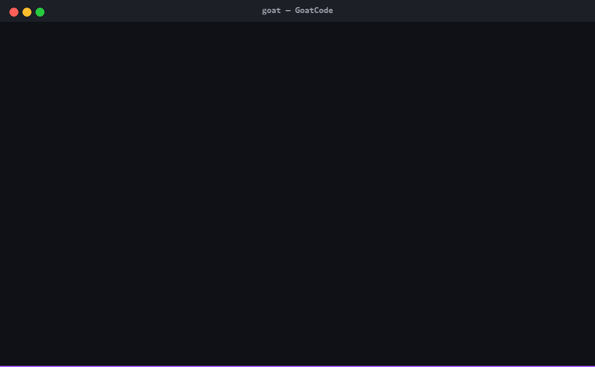
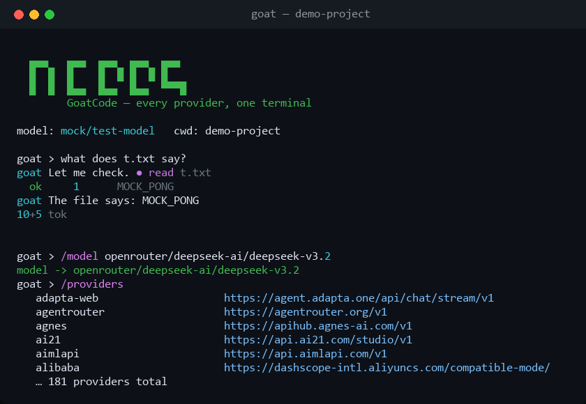

<div align="center">

# 🐐 GoatCode

**Every provider. One terminal. Built for machines with 4 GB of RAM.**

An agentic coding CLI that reads your codebase, edits files, runs commands,
and streams answers — talking to **183 providers** through one interface.
Authenticate with an API key *or* an existing subscription (Claude Pro/Max,
ChatGPT, Gemini, GitHub Copilot, Kimi, Grok): GoatCode turns the browser login
into a working API credential and refreshes it for you.



[Install](#install) · [Quick start](#quick-start) · [Providers](#providers) ·
[OAuth](#subscription-oauth) · [TUI](#the-tui) · [Config](#configuration)

</div>

---

## The problem

Coding agents lock you into one vendor, one billing account, one fat runtime.
GoatCode is the opposite bet:

| | GoatCode |
|---|---|
| **Providers** | 183 built in — OpenAI, Anthropic, DeepSeek, Groq, OpenRouter, Ollama, and 177 more, plus any custom endpoint |
| **Auth** | API keys *and* subscription OAuth (Claude, ChatGPT, Gemini, Copilot, Kimi, Grok) with auto-refresh |
| **Footprint** | ~41 MB import, no Electron, no Node, no database — three Python dependencies |
| **Safety** | Writes/edits/bash ask for approval; file tools sandboxed to the project root |
| **Sessions** | JSONL transcripts, resume any session, context compaction that survives tool calls |

## Demo

A real session — the agent reads a file, calls the `read` tool, and answers:



The GIF above is the same session, typed out. Both are rendered from actual
terminal output (see [`docs/`](docs/)) — not staged screenshots.

## Install

Requires Python 3.10+.

```bash
# from source (PyPI publish pending)
git clone https://github.com/Arhan-w/GoatCode && cd GoatCode
pip install -e ".[dev]"        # or: pip install .
```

Once installed, the `goat` command is on your PATH.

## Quick start

```console
$ goat auth anthropic --key sk-ant-...          # store an API key
stored API key for anthropic

$ goat                                           # launch the TUI
  ▄▄▄   ▄▄▄  ▄▄▄  ▄▄▄  ▄▄▄
  █  █  █    █  █ █  █ █
  █  █  █▄▄  █▄▄  █▄▄  ▀▀▀█
        GoatCode — every provider, one terminal

model: anthropic/claude-sonnet-4-5   cwd: ~/code/myapp   (/help for commands)

goat > rename the User model to Account and update every reference
● grep  "class User\b"
● edit  models/user.py
● edit  views/account.py
goat  Renamed User → Account across 6 files. Verify with: pytest tests/models
```

One-shot mode for scripts and CI:

```bash
goat -p "summarize what setup.py does" -q
goat --auto -m openrouter/deepseek-ai/deepseek-v3.2 -p "run the tests and fix failures"
```

## Providers

`goat providers` lists the full catalog — 183 entries, ✓ marking the ones
with credentials configured:

```console
$ goat providers
 ✓ anthropic                    [claude] https://api.anthropic.com/v1
 ✓ openai                       [openai] https://api.openai.com/v1
   deepseek                     [openai] https://api.deepseek.com/v1
   groq                         [openai] https://api.groq.com/openai/v1
   ollama-cloud                 [openai] https://ollama.com/v1
   openrouter                   [openai] https://openrouter.ai/api/v1
   … 183 providers total
```

Four wire formats cover every provider; the catalog maps each entry to one:

| Format | Endpoint | Used by |
|---|---|---|
| `openai` | `/chat/completions` | OpenAI + ~170 compatible endpoints (Groq, DeepSeek, OpenRouter, vLLM, Ollama, …) |
| `claude` | `/messages` | Anthropic Messages API (key or OAuth bearer) |
| `openai-responses` | `/responses` | OpenAI Responses API, ChatGPT Codex |
| `gemini` | `:streamGenerateContent` | Google Generative Language + Code Assist |

Models per provider:

```console
$ goat models anthropic
  anthropic/claude-fable-5-1
  anthropic/claude-fable-5
  anthropic/claude-opus-5
  anthropic/claude-sonnet-4-5
```

Environment variables are picked up automatically for matching providers:
`OPENAI_API_KEY`, `ANTHROPIC_API_KEY`, `GROQ_API_KEY`, `DEEPSEEK_API_KEY`,
and ~15 more.

## Custom endpoints

Any OpenAI- or Anthropic-compatible URL — LM Studio, vLLM, llama.cpp, a
company gateway — is one command away:

```console
$ goat endpoint add ollama --base-url http://localhost:11434/v1 \
    --format openai --models llama3.2,qwen2.5
added endpoint 'ollama' (openai) -> http://localhost:11434/v1
usage: goat -m ollama/<model> "..."

$ goat -m ollama/llama3.2 "explain this repo"
```

## Subscription OAuth

Turn an existing plan into an API credential — no key purchase needed:

```console
$ goat auth --list-oauth
  claude           Claude Pro/Max (OAuth)
  codex            ChatGPT Plus/Pro (OAuth)
  gemini           Gemini Code Assist (OAuth)
  github-copilot   GitHub Copilot (device OAuth)
  kimi             Kimi For Coding (device OAuth)
  grok             Grok (import token)

$ goat auth claude --oauth        # browser opens, PKCE + CSRF state
logged in to claude — try: goat -m claude/claude-sonnet-4-5 "hello"
```

| Provider | Flow | What happens |
|---|---|---|
| Claude Pro/Max | browser (PKCE) | authorize → token exchange → auto-refresh |
| ChatGPT Plus/Pro (Codex) | browser (PKCE) | Responses API over your subscription |
| Gemini Code Assist | browser | cloudcode-pa endpoint with OAuth bearer |
| GitHub Copilot | device code | GitHub device login → Copilot API token |
| Kimi For Coding | device code | device authorization → token |
| Grok | token import | paste a bearer from your Grok session |

Tokens live in `~/.goatcode/credentials.json` (chmod 600) and refresh
transparently before expiry.

## The TUI

| Key / command | What |
|---|---|
| type + `Enter` | send to the agent |
| `Ctrl+C` | cancel generation |
| `/model <provider/id>` | switch model mid-session |
| `/providers` · `/models` | browse providers and their models |
| `/auth <p> --key K` · `--oauth` | add credentials without leaving the chat |
| `/new` · `/sessions` · `/resume <id>` | session management |
| `/auto` · `/approve` | toggle tool auto-approval |
| `/quit` | exit |

Deliberately scrollback-native — no alt-screen redraw loop — so it stays
smooth over SSH, on ancient terminals (`--plain` drops the widget layer
entirely), and on low-RAM hardware.

## Configuration

`~/.goatcode/config.json` (user) and `./goatcode.json` (project — wins):

```json
{
  "model": "anthropic/claude-sonnet-4-5",
  "max_tokens": 8192,
  "auto_approve": false,
  "endpoints": {
    "ollama": {
      "base_url": "http://localhost:11434/v1",
      "format": "openai",
      "models": ["llama3.2", "qwen2.5"]
    }
  }
}
```

Env overrides: `GOAT_MODEL`, `GOAT_AUTO_APPROVE`, `GOAT_MAX_TOKENS`, and
`GOATCODE_HOME` to relocate all state.

## Safety model

- **Permission prompts** — `write`, `edit`, and `bash` show the exact target
  and wait for `y/n`. `read`/`glob`/`grep` are unrestricted.
- **Path sandbox** — file tools resolve and reject anything outside the
  project root (membership check, not string prefix — sibling dirs like
  `project-old/` are unreachable).
- **`--auto` is explicit** — it trusts the model with your shell; use it in
  throwaway checkouts or CI, not on your daily driver.
- **Bounded output** — 128 KB per read, 32 KB per bash call, so a runaway
  `find /` can't eat your RAM.

## Performance

Measured on this project (Python 3.10, Windows):

| Metric | Value |
|---|---|
| Full import working set | **41 MB** |
| Dependencies | 3 (`httpx`, `rich`, `prompt_toolkit`) |
| Cold start (`goat --version`) | ~0.8 s (heavy modules import lazily) |
| Test suite | 58 tests, ~8 s, no network |

## Development

```bash
pip install -e ".[dev]"
python -m pytest tests/ -q
..........................................................  [100%]
58 passed in 8.27s
```

The demo assets are generated from real sessions:
`python docs/capture_session.py session.ansi && python docs/render_ansi.py session.ansi out.png out.gif`

## Acknowledgements

- Architecture (agent loop, tool dispatch, provider/model split) is a
  clean-room design in the spirit of [opencode](https://github.com/anomalyco/opencode).
- The provider catalog and the OAuth-to-API-key idea come from
  [OmniRoute](https://github.com/diegosouzapw/OmniRoute).

## License

MIT
