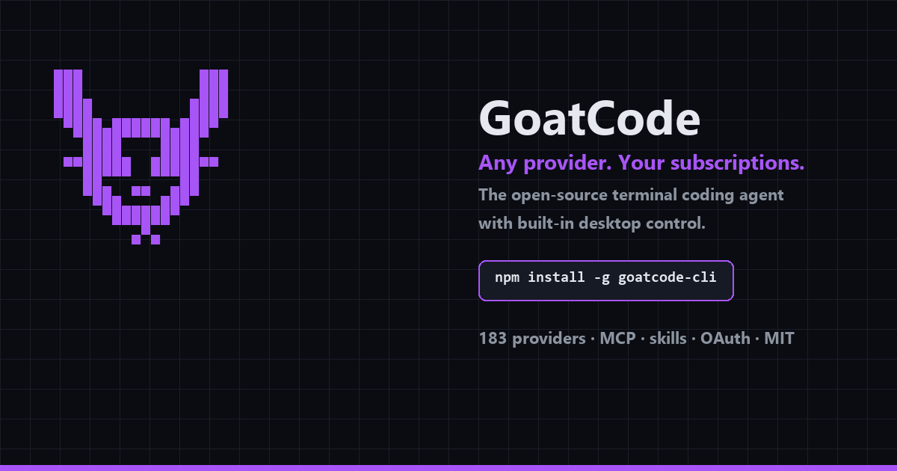

# GoatCode

[](https://github.com/Arhan-w/GoatCode/actions)
[](LICENSE)
[](https://www.npmjs.com/package/goatcode-cli)

<p align="center">
  
</p>

GoatCode is a terminal AI coding agent built for developers who want speed, control, and total flexibility.

One binary. Any provider (183+). Your subscriptions (Claude Pro/Max, ChatGPT, Gemini, Copilot, Kimi, Grok). MCP servers. Skills. Plugins. Desktop control.

No account lock-in. No fluff.

---

## Install

```bash
npm install -g goatcode-cli
```

No npm? One line on any OS:

```bash
# Windows PowerShell
powershell -c "irm https://raw.githubusercontent.com/Arhan-w/GoatCode/v2-typescript/install.ps1 | iex"

# Linux / macOS / Git-Bash
curl -fsSL https://raw.githubusercontent.com/Arhan-w/GoatCode/v2-typescript/install.sh | bash
```

Then run `goat auth` and start with `goat`.

---

## Quick Start

```bash
# Start interactive session
goat

# One-off prompt
goat -p "Create a React login component"
```

## Screenshots

<p align="center">
  
</p>

<p align="center">
  
</p>

## What it does

- **Desktop control**: click, type, scroll, launch apps
- **Vision**: read screenshots and act on what's visible
- **Parallel tools**: concurrent reads, smart batching
- **Subagents**: delegate research, explore, and planning tasks
- **Skills & MCP**: plug in tools and workflows
- **Self-update**: update check built in

---

## Usage

```bash
# Screenshot
goat -p "screenshot"

# Click something
goat -p "computer click x=500 y=300"

# Analyze a screenshot
goat -p "What's visible on screen?"
```

## Providers

OpenAI, Anthropic, Google, Groq, Mistral, xAI, Together, Fireworks, DeepSeek, OpenRouter, Cloudflare, Voyage, LocalAI, Ollama, LM Studio, MLX, llama.cpp, and many more.

## Contributing

1. Clone: `git clone https://github.com/Arhan-w/GoatCode.git`
2. Install: `bun install`
3. Build: `bun run build`
4. Test: `bun test`

## License

MIT. See `LICENSE`.

---

Made by Arhan. All rights reserved.
