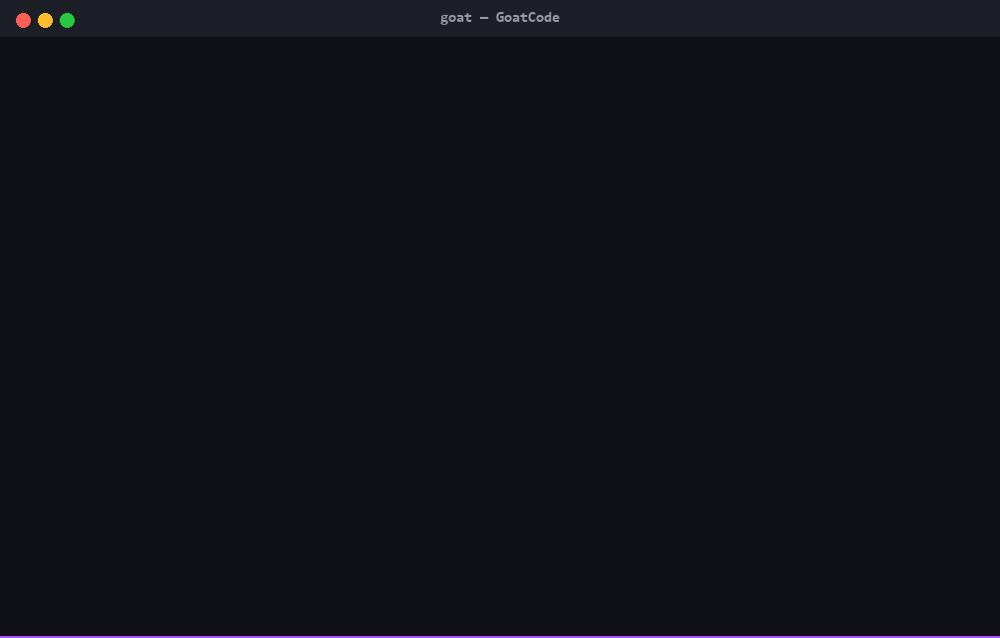
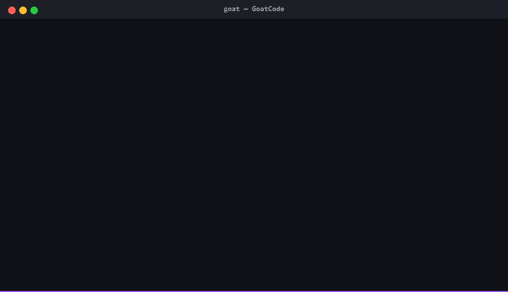
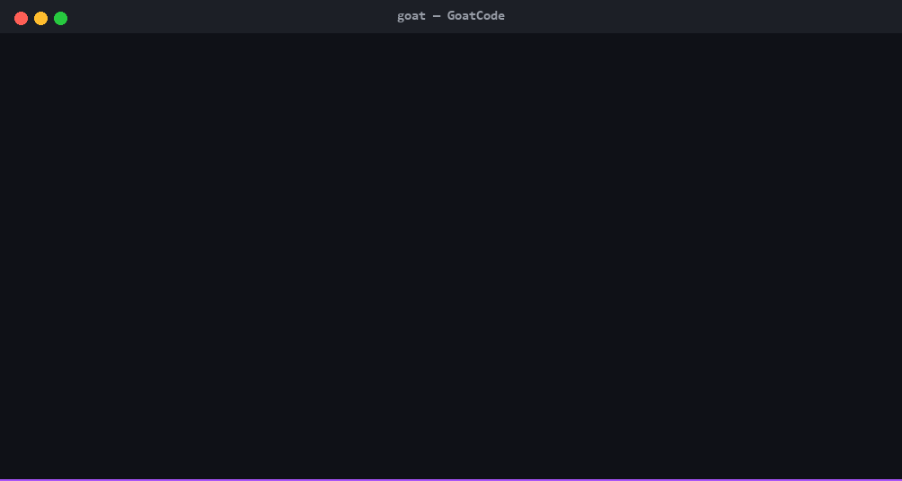
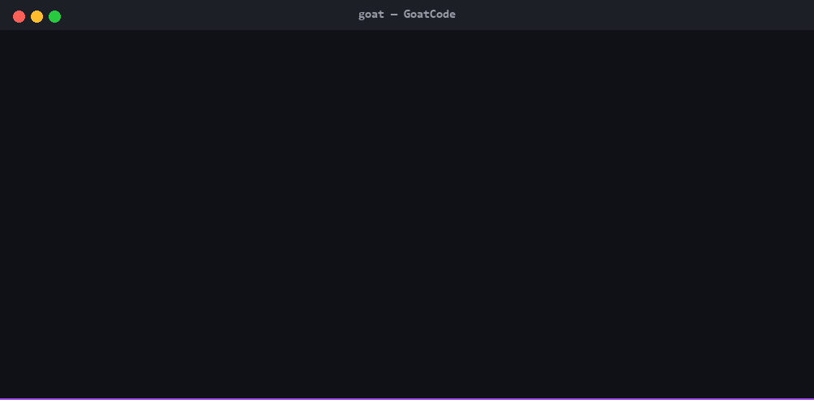
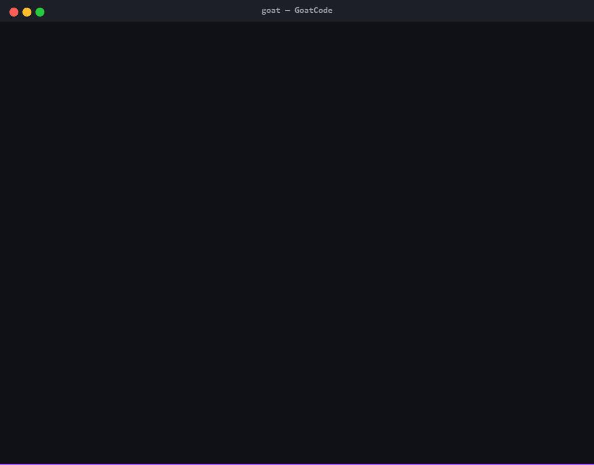

<div align="center">

# GoatCode v3.3.5
### The Autonomous Multi-Repo AI Coding Agent for the Terminal

[](https://github.com/Arhan-w/GoatCode/actions)
[](https://github.com/Arhan-w/GoatCode/releases)
[](LICENSE)

*Every provider. Multi-repo workspaces. Code intelligence graph. Secure P2P/relay collaboration. Agent-as-a-Service JSON-RPC.*

[**Quick Start**](#installation) · [**Architecture**](#architecture) · [**Commands**](#slash-commands) · [**Documentation**](#documentation)

</div>

---

## What is GoatCode v3?

GoatCode v3 is a major architectural leap designed for professional developers who demand complete control, sub-second code intelligence, and team collaboration without leaving their terminal. Powered by Bun and TypeScript, GoatCode combines **180+ LLM providers** (with intelligent fallback chains and Anthropic prompt caching) with four brand-new pillars:

1. **Multi-Repo Workspaces (`workspace.repos`)** — Mount multiple repositories simultaneously, run cross-repo searches (`/find`, `/index`), and enforce per-repo sandboxes and strict permission rule forms.
2. **Code Intelligence Graph (`src/code`)** — Zero-config tree-sitter parser with WASM fallback supporting TS, JS, Python, Go, SQL, Rust, and more. Incremental mtime+size fast path, atomic persistence, TF-IDF ranked symbol lookup, and **hybrid semantic search** with ONNX-based local embeddings.
3. **P2P Collaboration Relay (`src/collab`)** — End-to-end encrypted WebSocket relay with Lamport timestamp sequencing, invite codes, turn tokens, and live peer synchronization.
4. **Agent-as-a-Service Protocol (`src/protocol`)** — JSON-RPC 2.0 over HTTP (`POST /rpc`) and WebSocket with constant-time token auth, path-jailed execution, and remote agent mounting (`remote_<name>`).
5. **Signed Plugin Marketplace (`src/plugins`)** — Secure tar+gzip extractor with path-traversal/bomb guards and ed25519 signature verification against pinned keys. **Plugin sandboxing** with process isolation, memory limits, and filesystem scoping.
6. **Goated-Flash-Free** — Zero-config built-in free tier: when no API key is connected, GoatCode auto-boots an embedded free inference engine, giving you full AI coding out of the box with zero setup.
7. **Circuit Breaker Failover** — Automatic mid-stream provider switching when consecutive failures detected, with per-provider health tracking and graceful degradation.
8. **Semantic Code Search** — Local ONNX-based MiniLM-L6-v2 embeddings (384-dim) for zero-API-cost semantic codebase search, with hash-based fallback for environments without ONNX runtime.
9. **Virtualized TUI Lists** — Windowed rendering for sessions, search results, and file trees — handles thousands of items without UI lag.
10. **Session Branching** — Fork conversations with `/fork`, creating child sessions that share history up to the branch point. Track all branches in the parent session's metadata.
11. **Goat Doctor Diagnostics** — Run `/doctor` for 8-point system health check covering providers, configs, credentials, and network connectivity.
12. **Crash Recovery** — Append-only session persistence with crash recovery markers. Resume interrupted sessions via `/recover`.

---

## Key Features

- **🐐 GOAT MODE (`--bypass`)** — Unchained permission bypass with zero prompts and instant execution when you need maximum velocity.
- **Noir Terminal Theme** — Crafted with deep dark panels (`#25262D`), a true-black input box (`#000F08`), and vibrant violet accents (`#a855f7`).
- **Anthropic Prompt Caching** — Automatic ephemeral block wrapping (`cache_control: { type: "ephemeral" }`) cutting input costs by 90% on repeated turns.
- **Smart Failover & Retry** — Automatic rotation across fallback models when encountering rate limits (429) or transient server errors, with circuit breaker protection.
- **Context Meter & `/rewind`** — Real-time token usage progress bar and full checkpoint rollback for both conversation transcripts and modified files.
- **Command Palette** — Press `Ctrl+P` for contextual command suggestions as you type.
- **Onboarding Wizard** — First-run setup flow guides new users through authentication and configuration.
- **Streaming I/O** — Buffered SSE token delivery (16 chars / 50ms) for smoother TUI rendering, and streaming file operations for large files.
- **Parallel Subagent Execution** — Ultracode-style fan-out with up to 8 concurrent subagents, dependency-aware scheduling, and isolated workspaces via `ToolKit.clone()`.
- **Subagent Isolation** — Each subagent gets its own `ToolKit` copy with isolated file state and tool permissions.
- **Error Taxonomy** — 17 error codes with actionable suggestions for common failure modes.

---

## Comparison

| Feature | GoatCode v3 | Claude Code | Codex CLI | OpenCode |
| :--- | :---: | :---: | :---: | :---: |
| **Providers** | **180+ (All OAI/Anthropic/Gemini + Custom)** | Anthropic only | OpenAI only | Multi |
| **Multi-Repo Workspace** | ✅ Native (`roots` map) | ❌ Single | ❌ Single | ❌ Single |
| **Code Intelligence** | ✅ Tree-sitter + WASM + Rank + **Semantic** | ❌ Basic grep | ❌ Basic grep | ❌ Basic grep |
| **Collab & Relay** | ✅ Lamport Sync + Invite codes | ❌ None | ❌ None | ❌ None |
| **Agent-as-a-Service** | ✅ JSON-RPC 2.0 + Remote tools | ❌ None | ❌ None | ❌ None |
| **Signed Plugins** | ✅ Ed25519 + Tar + Bomb guard + **Sandbox** | ❌ None | ❌ None | ❌ None |
| **Session Branching** | ✅ `/fork` with shared history | ❌ None | ❌ None | ❌ None |
| **Diagnostic Tool** | ✅ `/doctor` 8-point health check | ❌ None | ❌ None | ❌ None |
| **Pricing / License** | **MIT (Open Source)** | Proprietary | Proprietary | MIT |

---

## Installation

Install globally via npm (recommended):

```bash
npm install -g goatcode-cli
```

Or run directly without installing:

```bash
npx goatcode-cli
```

Or grab a precompiled binary for Linux, macOS, or Windows from the [Releases Page](https://github.com/Arhan-w/GoatCode/releases).

---

## Quick Start

1. Install and run — **that's it**. With no API key configured, GoatCode boots on **Goated-Flash-Free** (an embedded free model, zero setup):
   ```bash
   npm install -g goatcode-cli
   goat
   ```

2. Add a real provider whenever you want (GoatCode switches to it automatically):
   ```bash
   goat auth openai sk-...
   ```
   Switch models by hand with `/model flash` (back to free) or `/model anthropic/claude-sonnet-4-5`.

3. Build the code index and search symbols:
   ```text
   /index
   /find resolveRepos
   ```

4. Run diagnostics to check your setup:
   ```text
   /doctor
   ```

5. Share your session with a teammate:
   ```text
   /share
   ```

---

## Slash Commands

| Command | Description |
| :--- | :--- |
| `/help` | List all available commands and shortcuts |
| `/model <name>` | Switch active model or model alias (`opus`, `sonnet`) |
| `/index` | Build or refresh the workspace code intelligence index |
| `/find <symbol>` | Ranked symbol lookup across all workspace repositories |
| `/ultraplan <goal>` | Fan the goal out to parallel scout subagents, then merge one prioritized plan |
| `/share` | Generate an invite code and start a collab relay session |
| `/peers` | List connected peers in the active collab session |
| `/handoff` | Transfer the turn-token to a peer |
| `/rewind` | Revert transcript and modified files back to a previous turn |
| `/permissions` | Manage always-allow security rules for the current session |
| `/marketplace` | Browse and install signed community plugins |
| `/search` | Full-text search across all saved local sessions |
| `/fork` | Create a branch session sharing history up to current point |
| `/recover` | Recover from a crash by replaying pending tool calls |
| `/doctor` | Run 8-point system diagnostics and health checks |
| `/compact` | Summarize old messages to free context space |
| `/quit` | Exit GoatCode |

---

## Demos

**🎬 Launch reel (60s, landscape):** https://github.com/Arhan-w/GoatCode/releases/download/v3.2.0/reel_landscape.mp4


*`/index` builds the workspace code graph, then `/find x` ranks symbols across repos with hybrid keyword + semantic search.*


*Real-time P2P relay collaboration via invite code — presence, turn tokens, peer chat.*


*Generate a collab invite code and join a shared workspace session.*


*Zero config: with no API key set, GoatCode auto-boots the embedded Goated-Flash-Free server and answers instantly — free, on loopback.*


*`/ultraplan` decomposes the goal into parallel scouts that fan out via subagents and synthesize one prioritized plan.*

---

### v3.2 Improvements


*Run `/doctor` for a full system health check covering providers, configs, credentials, and network.*


*Append-only sessions with crash recovery markers. `/recover` replays pending tools after a crash.*


*Fork conversations with `/fork`. Branches share history and track fork metadata.*


*Circuit breaker detects repeated failures and switches providers mid-stream automatically.*

---

## Architecture & Development

GoatCode is built with clean, modular TypeScript:

```tree
src/
├── agent.ts       # Main agent loop & subagent batching
├── agent-enhanced.ts  # Enhanced agent with ReAct/Plan-and-Execute
├── code/          # Tree-sitter AST indexer, semantic embeddings, hybrid search
│   ├── indexer.ts
│   ├── find.ts    # Symbol search with ranking + RRF fusion
│   ├── semantic.ts # ONNX MiniLM-L6-v2 embeddings + VectorIndex
│   ├── grammars.ts
│   ├── extract.ts
│   └── find.ts
├── collab/        # Lamport sync, websocket relay & invite codes
├── protocol/      # JSON-RPC 2.0 server & remote agent client
├── plugins/       # Signed plugin marketplace & sandbox isolation
│   ├── loader.ts
│   └── sandbox.ts
├── code/          # Tree-sitter indexer, semantic embeddings, hybrid search
│   ├── indexer.ts
│   ├── find.ts    # Symbol search with ranking + RRF fusion
│   └── semantic.ts # ONNX MiniLM-L6-v2 embeddings + VectorIndex
├── collab/        # Lamport sync, websocket relay & invite codes
├── protocol/      # JSON-RPC 2.0 server & remote agent client
├── tools.ts       # File, search, workspace and shell toolkit
├── doctor.ts      # System diagnostics (8 checks)
├── rate-limiter.ts # Token bucket rate limiter with registry
├── palette.tsx    # Command palette (Ctrl+P)
├── onboarding.ts  # First-run wizard
├── virtual-list.tsx # Windowed list rendering for TUI
├── session.ts     # Append-only JSONL persistence, crash recovery, branching
├── llm.ts         # Streaming SSE with token buffering
├── providers.ts   # Lazy provider catalog, rate limit integration
└── tui.tsx        # Ink-based TUI with noir theme and virtualized lists
```

Run tests locally:
```bash
bun test
```

---

## License

MIT License © 2026 Arhan (Goated). See [LICENSE](LICENSE) for details.
